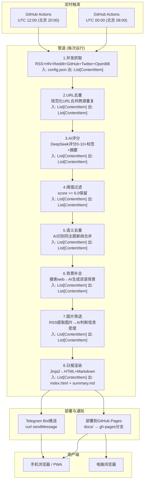

# Daily Focus 设计方案 v2

## 一、需求背景

每日早间（08:00）和晚间（20:00）各生成一份个性化信息摘要网页，覆盖三个主题领域：

- **AI 技术进展**：前沿论文、模型发布、开源项目、技术突破
- **AI 市场动态**：头部公司战略变化、创业公司融资与收购
- **全球经济要闻**：影响股市的宏观事件、央行政策、地缘经济变动

网站不对外公开（robots.txt + meta noindex），手机和电脑浏览器均可阅读。使用 DeepSeek V4-Pro 作为内容分析基座。无常驻服务器，全部通过 GitHub Actions 定时触发，部署到 GitHub Pages。

---

## 二、选型：Horizon

[Horizon](https://github.com/Thysrael/Horizon)（MIT License，5000+ Stars）作为 Base 项目。Python 全栈，七步管道经过社区验证——多源并发抓取、URL 去重、AI 评分(0-10)、阈值过滤、语义去重、背景知识补全、日报生成。原生支持 DeepSeek、双语输出、九种数据源抓取器、JSON 文件配置所有行为、GitHub Actions + Pages 部署链路已跑通。 

需要改动的部分：信息源配置（替换为三大主题源）、AI prompt（评分导向调整）、前端模板（Jekyll → Jinja2 + Tailwind CSS）、双 cron 调度（早晚报）、隐私防护、图片筛选、推送通知。

---

## 三、整体架构

### 3.1 数据流



### 3.2 各步骤数据格式说明

每一步的输入和输出都是 `List[ContentItem]`，中间步骤通过修改 ContentItem 的字段传递结果。具体来说：

| 步骤 | 写入 ContentItem 的字段 |
|------|------------------------|
| 并发抓取 | id, source_type, title, url, content, author, published_at, metadata |
| URL去重 | metadata["merged_sources"] |
| AI评分 | ai_score, ai_reason, ai_summary, ai_tags |
| 阈值过滤 | （移除低分条目，不写字段） |
| 语义去重 | content（合并重复条目的讨论内容） |
| 背景补全 | metadata["detailed_summary_en/zh"], metadata["background_en/zh"], metadata["community_discussion_en/zh"] |
| 图片筛选 | metadata["candidate_images"], metadata["selected_images"] |
| 日报渲染 | （读取以上所有字段，生成 HTML 和 Markdown 文件） |

这个设计的好处是：每个步骤可以独立测试——给定一组已知 ContentItem 作为输入，验证输出 ContentItem 的对应字段是否符合预期。

---

## 四、验证总策略

用户的核心痛点：上一个项目（Godot 游戏开发）中 agent 无法自我验证产出，所有测试负担落在用户身上。本方案的核心设计原则是：**每个改造步骤都有对应的自动化验证，agent 在声称「完成」之前必须先跑通验证**。

### 4.1 验证层级

```
Layer 1: 单元测试 (Python pytest)
  - 验证每个独立函数/类的行为正确
  - agent 执行: uv run pytest tests/
  - 耗时: < 10 秒

Layer 2: 管道步骤测试 (Python pytest)
  - 给定 mock 输入，验证单步管道的输出字段正确
  - agent 执行: uv run pytest tests/
  - 耗时: < 30 秒

Layer 3: 端到端测试 (本地完整运行)
  - 用真实配置跑一次完整管道（time_window=1h，减少抓取量）
  - agent 执行: uv run horizon --hours 1
  - 耗时: 2-5 分钟（取决于 API 调用速度）

Layer 4: 浏览器验证 (人工)
  - 打开生成的 HTML 文件，在手机/电脑浏览器中查看样式
  - 用户执行
  - 耗时: 2 分钟

Layer 5: 线上验证 (人工 + 自动)
  - workflow_dispatch 手动触发，确认部署成功 + Telegram 通知到达
  - 用户执行一次，后续自动运行
```

### 4.2 Agent 自我验证清单

每个 agent 在标记工作完成前，必须确认以下三项：

1. 所有新增/修改的代码通过了相关 pytest 用例
2. 如果修改了 prompt，用 mock 数据调用一次 AI 验证 JSON 输出可正确解析
3. 如果修改了管道逻辑，本地跑一次 `uv run horizon --hours 1` 确认无崩溃

这三项在 agent 本地环境可以直接执行（前提是配置了 `DEEPSEEK_API_KEY` 环境变量）。不需要用户介入。

### 4.3 现有测试资产

Horizon 已有 15 个 pytest 文件覆盖抓取器、分析器、摘要器、存储、邮件、webhook。我们的改造应当：

- **扩展**已有测试（如 `test_rss.py` 加入图片提取验证）
- **新增**测试文件（如 `test_image_selector.py`、`test_html_renderer.py`）
- **不破坏**已有测试（改造前后全量 pytest 必须保持绿色）

---

## 五、改造步骤

六个工作区。A、B、C、F 互相独立，**并行开工**。D 汇总 A 和 C 的产出，E 在 D 之后。

每个工作区包含四个固定小节：
- **输入契约**：依赖什么、从哪读取、格式是什么
- **输出契约**：产出什么、写到哪、格式是什么
- **开发步骤**：具体的文件修改和新增清单
- **验证方法**：Layer1-3 的具体测试用例

---

### 工作区 A：信息源配置

**输入契约**
- Horizon 的 `data/config.example.json`（参考模板）
- 需求文档第一节的三大主题定义

**输出契约**
- `data/config-morning.json`：早报配置，含 AI 技术 + 市场数据源，time_window_hours=14
- `data/config-evening.json`：晚报配置，含 AI 技术 + 市场 + 经济数据源，time_window_hours=10
- 两个文件均需通过 `Config.model_validate()` 校验

**开发步骤**

1. 从 `data/config.example.json` 复制出 `config-morning.json` 和 `config-evening.json`
2. 修改 `ai` 块：provider 设为 `"deepseek"`，model 设为 `"deepseek-chat"`（待确认 V4-Pro 实际 model name），languages 设为 `["zh", "en"]`，temperature 保持 0.3
3. 修改 `sources.rss` 块：添加以下 RSS 源

早报 RSS 源（AI 技术 + 市场）：
- HuggingFace Daily Papers: `https://huggingface.co/papers/feed.xml`
- ArXiv cs.AI new: `https://rss.arxiv.org/rss/cs.AI`
- ArXiv cs.CL new: `https://rss.arxiv.org/rss/cs.CL`
- 机器之心: `https://www.jiqizhixin.com/rss`
- 量子位: `https://www.qbitai.com/feed`
- TechCrunch: `https://techcrunch.com/feed/`
- The Verge: `https://www.theverge.com/rss/index.xml`
- 36氪: `https://36kr.com/feed`
- Reuters Technology: `https://www.reutersagency.com/feed/?best-topics=tech`

晚报 RSS 源（在上述基础上增加经济）：
- Reuters Business: `https://www.reutersagency.com/feed/?best-topics=business-finance`
- 其余同早报

4. 修改 `sources.reddit` 块：
   - subreddits 列表：`MachineLearning` (min_score=50), `LocalLLaMA` (min_score=20), `singularity` (min_score=50)
   - fetch_comments 保持 5

5. 修改 `sources.hackernews`：min_score 调高到 150，减少非 AI 内容的干扰

6. 修改 `sources.ossinsight`：enabled=true, keywords 设为 `["ai", "machine-learning", "llm", "deep-learning"]`, languages 设为 `["All", "Python", "TypeScript", "Rust"]`

7. 修改 `filtering`：ai_score_threshold 早报 6.0，晚报 5.5（傍晚信息量通常比清晨少，稍低阈值保证内容量）

8. Twitter 和 OpenBB 设为 enabled=false（可选，需要额外 API key）

9. 将 DeepSeek API key 的环境变量名统一为 `DEEPSEEK_API_KEY`

**验证方法**

| 层级 | 测试 | 命令/方法 |
|------|------|-----------|
| L1 | 配置文件可被 Horizon 的 Config 模型正确解析 | `python -c "from src.models import Config; import json; Config.model_validate(json.load(open('data/config-morning.json')))"` |
| L1 | 所有 RSS URL 格式合法（scheme 为 http/https） | `python -c "from pydantic import HttpUrl; ..."` 遍历每个 RSS url 字段 |
| L2 | 用早报配置跑一次 `--hours 1`，确认各抓取器正常返回数据（不要求返回多少条，只要求不报错） | `uv run horizon --hours 1` (需要先 cp config-morning.json config.json + 设置 DEEPSEEK_API_KEY) |
| L2 | 同上验证晚报配置 | 同方法换 config-evening.json |

---

### 工作区 B：AI Prompt 主题化改造

**输入契约**
- `src/ai/prompts.py` 文件
- 需求文档定义的三大主题

**输出契约**
- 修改后的 `src/ai/prompts.py`：`CONTENT_ANALYSIS_SYSTEM` 和 `TOPIC_DEDUP_SYSTEM` 替换为定向版本
- 新增 `tests/test_prompts_theme.py`：prompt 有效性测试

**开发步骤**

1. 修改 `CONTENT_ANALYSIS_SYSTEM`：删除原有「software engineering, AI/ML, systems research」导向的 5 档评分标准，替换为：

```
9-10 分：AI 重大突破（新架构、范式改变）、头部公司战略级变动（收购/重组/关键高管变动）、
         影响全球市场的宏观政策变动（央行转向、贸易政策剧变）
7-8 分：重要进展（新工具/服务发布、融资轮、季度财报关键数据、深度行业分析）、
         值得关注的创业公司动向
5-6 分：增量更新、常规报道、二线公司日常
0-4 分：纯营销内容、与 AI/市场/经济无关、低质量转载

核心筛选原则：这条信息是否会影响 AI 从业者或投资者的判断/行动
```

2. 修改评分 prompt 中的「Consider」部分：增加对「市场信号」和「经济影响」的关注权重，降低「代码质量」类权重

3. 修改 `TOPIC_DEDUP_SYSTEM`：在「相同事件」判断标准中增加 AI/商业语境下的典型去重场景描述（同一轮融资的不同报道、同一模型发布的不同媒体稿）

4. 新建 `tests/test_prompts_theme.py`：

```
# 测试 1: 评分 prompt JSON 可解析性
#   用 mock 数据调一次 DeepSeek，验证返回的 JSON 包含 score(0-10), reason, summary, tags 四个字段
#
# 测试 2: 去重 prompt 有效性
#   喂入一组已知包含重复的新闻标题，验证 AI 正确分组
#
# 测试 3: 评分边界
#   喂入明显的高价值新闻（如"OpenAI releases GPT-5"），验证 score >= 8
#   喂入明显的低价值新闻（如"X公司发布blog庆祝办公室搬迁"），验证 score <= 4
```

**验证方法**

| 层级 | 测试 | 命令/方法 |
|------|------|-----------|
| L1 | pytest 测试 prompt 解析性和评分边界 | `uv run pytest tests/test_prompts_theme.py -v` |
| L2 | 用修改后的评分 prompt 跑 ContentAnalyzer 处理一组 mock ContentItem，验证每个 item 都有有效 score | `uv run pytest tests/test_analyzer.py -v` (Horizon 已有，确认兼容) |
| L2 | 用修改后的去重 prompt 跑 topic dedup，验证去重逻辑正确 | `uv run pytest tests/` 中相关的去重测试 |

---

### 工作区 C：前端模板重写

**输入契约**
- `src/ai/summarizer.py` 当前 `DailySummarizer.generate_summary()` 返回 Markdown 字符串
- 工作区 D 确定的渲染流程：Jinja2 模板生成 HTML
- `docs/` 目录结构

**输出契约**
- 新增 `src/templates/` 目录（Jinja2 模板文件）
- 新增 `src/renderer.py`：HTML 渲染模块，从结构化数据生成完整 HTML
- 新增 `src/templates/daily.html`：日报页面模板（移动端 375px 起，最大宽度 680px）
- 新增 `src/templates/archive.html`：历史存档页面模板
- 新增 `src/templates/index.html`：首页（自动跳转最新一期）
- 修改 `src/ai/summarizer.py`：DailySummarizer 新增 `get_structured_data()` 方法，返回 dict 而非 Markdown 字符串
- 新增 `docs/robots.txt`：`User-agent: * Disallow: /`
- 新增 `docs/manifest.json`：PWA manifest
- 新增 `docs/sw.js`：最小 Service Worker（缓存策略）
- 新增 `tests/test_renderer.py`：渲染模块测试

**开发步骤**

1. 重构 DailySummarizer：新增 `get_structured_data(items, date, total_fetched, language)` 方法，返回 dict：
```python
{
    "date": "2026-05-31",
    "period": "morning",  # 由调用方传入
    "language": "zh",
    "total_fetched": 78,
    "selected_count": 12,
    "next_update": "今晚 20:00",
    "items": [
        {
            "index": 1,
            "title": "OpenAI 正式发布 GPT-5",
            "title_en": "OpenAI Releases GPT-5",
            "url": "https://...",
            "score": 9.2,
            "source_label": "TechCrunch",
            "source_type": "rss",
            "published_at": "2026-05-31T06:30:00Z",
            "whats_new": "...",
            "why_it_matters": "...",
            "key_details": "...",
            "background": "...",
            "community_discussion": "...",
            "tags": ["AI", "模型发布", "OpenAI"],
            "images": [{"url": "...", "alt": "GPT-5 benchmark comparison"}],
            "references": [{"title": "...", "url": "..."}],
        },
        # ...
    ]
}
```

2. 编写 Jinja2 模板 `daily.html`：
   - 单栏布局，max-width 680px，居中
   - 顶部：Daily Focus 标题 + 日期 + 时段标签（早报/晚报）+ 精选统计
   - 每条新闻一张卡片：序号 + 标题（可点击跳转原文）+ 星级评分 + 来源行 + 发生了什么 + 为什么重要 + `<details>` 折叠的背景 + 标签 + 图片（如有）
   - 底部：下次更新时间 + robots 声明
   - 暗色模式通过 CSS 自定义属性 + `prefers-color-scheme` 媒体查询实现
   - 字体栈：`"PingFang SC", "Hiragino Sans GB", "Noto Sans SC", "Microsoft YaHei", sans-serif`

3. 编写 CSS（Tailwind CSS v4 CLI 编译）：
   - 复用 Horizon 现有 sunrise 色板作为 CSS 变量
   - 卡片带边框和圆角，hover 微阴影
   - 标签用圆角药丸样式
   - 评分用彩色数字（9+ 红色，7-8 橙色，5-6 灰色）

4. 编写 `renderer.py`：接受 `get_structured_data()` 的输出 dict，调用 Jinja2 渲染，写入 `docs/index.html`

5. 添加 PWA 支持：`docs/manifest.json` + `docs/sw.js`，HTML head 中引用

6. 编写 `archive.html` 模板：按日期倒序列出所有历史日报链接

7. 在 HTML head 中添加 `<meta name="robots" content="noindex, nofollow">`

**验证方法**

| 层级 | 测试 | 命令/方法 |
|------|------|-----------|
| L1 | 用 mock 数据调 `get_structured_data()`，验证返回 dict 的字段完整性和类型正确性 | `uv run pytest tests/test_renderer.py -v` |
| L1 | 用 mock 数据调 `renderer.render_html()`，验证输出是合法的 HTML（无未闭合标签、charset 声明正确） | `python -c "from src.renderer import render_html; html = render_html(mock_data); open('/tmp/test.html','w').write(html)"` 然后用浏览器打开 `/tmp/test.html` 查看 |
| L1 | 验证 HTML 中包含 robots meta 标签 | `grep 'noindex' /tmp/test.html` |
| L1 | 验证 PWA manifest.json 可被解析 | `python -c "import json; json.load(open('docs/manifest.json'))"` |
| L2 | 用不同语言的 mock 数据验证中英文渲染都不报错 | 分别传入 language="zh" 和 language="en" 的 mock 数据 |
| L4 | 浏览器打开生成的 HTML，检查 375px / 768px / 1440px 三种宽度下无横向溢出 | 人工或用浏览器 DevTools 模拟 |

---

### 工作区 F：图片提取与智能筛选

**输入契约**
- `src/scrapers/rss.py`：当前 `_extract_content()` 只提取文本
- `src/ai/prompts.py`：需要新增图片判断 prompt
- ContentItem.metadata 字段可自由扩展

**输出契约**
- 修改 `src/scrapers/rss.py`：`_extract_content()` 同时提取候选图片列表，写入 metadata["candidate_images"]
- 新增 `src/ai/image_selector.py`：ImageSelector 类，批量判断图片信息密度
- 修改 `src/ai/prompts.py`：新增 `IMAGE_SELECTION_SYSTEM` 和 `IMAGE_SELECTION_USER` prompt
- 修改 `src/orchestrator.py`：在「背景补全」之后、「日报渲染」之前插入图片筛选步骤
- 新增 `data/image_cache.json`：记录已见过的图片 URL 用于去重
- 新增 `tests/test_image_selector.py`
- 修改 `tests/test_rss.py`：验证图片提取逻辑

**开发步骤**

1. 改造 RSSScraper._extract_content()：
   - 保留现有文本提取逻辑
   - 新增：用 BeautifulSoup 解析 content HTML，遍历所有 `` 标签
   - 对每张图片收集：src、alt、上下文（before=图片前100字符纯文本、after=图片后100字符纯文本）
   - 规则预过滤：URL 含 logo/avatar/icon/headshot/button 的跳过
   - URL 历史去重：读取 `data/image_cache.json`，出现超过 3 次的 URL 跳过
   - 每条 RSS 条目最多保留 5 张候选图片
   - 存入 `item.metadata["candidate_images"]` = `[{"url": "...", "alt": "...", "before": "...", "after": "..."}, ...]`

2. 编写 ImageSelector 类（`src/ai/image_selector.py`）：
   - 接收 `List[ContentItem]`（仅高评分条目）
   - 收集所有 `metadata["candidate_images"]`
   - 组装批量 prompt，**一次 API 调用**判断所有图片
   - 解析返回 JSON，将 informational 图片写入 `metadata["selected_images"]`
   - decorative 图片不写入
   - 失败时静默降级：不写入任何 selected_images

3. 新增 prompt 模板（`src/ai/prompts.py`）：

```
IMAGE_SELECTION_SYSTEM: 你是新闻图片分类助手。判断图片类型。

IMAGE_SELECTION_USER:
给你 {n} 张候选图片的描述（alt文本+前后文）。
判断每张属于：
  "informational" — 含数据、对比、走势、图表、跑分、架构图等实质信息
  "decorative"  — 合影、logo、产品外观、会议现场、示意配图

判断信号：
  informational: alt含数字/百分比/benchmark/vs/comparison/图表/走势/对比
  decorative: alt为空、上下文有人名/职位/conference/announced/产品外观描述

返回 JSON: {"results": [{"index": 0, "category": "informational|decorative", "confidence": 0.9}, ...]}
```

4. 在 HorizonOrchestrator.run() 的管道中插入图片筛选步骤：
   - 位置：`_enrich_important_items` 之后，`summarizer.generate_summary` 之前
   - 新增方法 `_select_images(items)` 调用 ImageSelector

5. 编写测试 `tests/test_image_selector.py`：
   - 测试 1：用已知 informational 上下文（alt="GPT-5 vs Claude 4 benchmark comparison on MMLU"）的 mock 数据，验证 AI 判定为 informational
   - 测试 2：用已知 decorative 上下文（alt="Sam Altman"）的 mock 数据，验证 AI 判定为 decorative
   - 测试 3：空候选列表，验证不崩溃
   - 测试 4：AI 返回无效 JSON，验证降级不崩溃

**验证方法**

| 层级 | 测试 | 命令/方法 |
|------|------|-----------|
| L1 | RSS 抓取器图片提取：用已知含 img 标签的 RSS XML 字符串作为 mock 数据，验证 candidate_images 字段正确填充 | `uv run pytest tests/test_rss.py -v` |
| L1 | 图片 URL 过滤规则：logo/avatar/icon 被正确排除 | `uv run pytest tests/test_image_selector.py::test_filter_rules -v` |
| L2 | ImageSelector 端到端：mock ContentItem 列表（含 candidate_images），调 AI 验证返回 selected_images 正确分类 | `uv run pytest tests/test_image_selector.py -v` (需要 DEEPSEEK_API_KEY) |
| L2 | 降级测试：模拟 AI 调用异常，验证 ImageSelector 不抛异常 | `uv run pytest tests/test_image_selector.py::test_degradation -v` |

---

### 工作区 D：定时调度、部署集成与隐私防护

**输入契约**
- 工作区 A 产出的 `config-morning.json` 和 `config-evening.json`
- 工作区 C 产出的 `src/renderer.py` 和 `src/templates/`
- 工作区 F 产出的 `src/ai/image_selector.py`

**输出契约**
- `.github/workflows/daily-focus-morning.yml`：早报 workflow
- `.github/workflows/daily-focus-evening.yml`：晚报 workflow
- `.github/workflows/deploy-pages.yml`：部署 workflow（替代原有 deploy-docs.yml）
- `scripts/render_and_deploy.py`：渲染 + 部署脚本
- `docs/robots.txt`（如果工作区 C 未创建）
- 修改 `src/orchestrator.py`：集成 ImageSelector、支持 period 参数（morning/evening）
- 修改 `src/main.py`：新增 `--period` CLI 参数，传入 orchestrator

**开发步骤**

1. 修改 `src/main.py`：
   - 新增 `--period` CLI 参数，可选值 `morning` / `evening`
   - 传入 HorizonOrchestrator

2. 修改 `src/orchestrator.py`：
   - `run()` 方法新增 `period` 参数
   - 在 enrich 之后、summarize 之前调用 ImageSelector
   - 将 period 传给 summarizer 的 `get_structured_data()`，影响 HTML 标题（"早报"/"晚报"）

3. 编写 `scripts/render_and_deploy.py`：
   - 读取 `data/summaries/` 中最新生成的 Markdown 文件
   - 调用 `src/renderer.py` 渲染 HTML → 写入 `docs/index.html`
   - 同步生成 `docs/archive.html`
   - 复制 `config-morning.json` 或 `config-evening.json` → `data/config.json`

4. 编写 `.github/workflows/daily-focus-morning.yml`：
   - `on.schedule[0].cron: "0 0 * * *"`（UTC 00:00 = 北京 08:00）
   - 环境变量 `PERIOD=morning`
   - 选择早报配置：`cp data/config-morning.json data/config.json`
   - 运行：`uv run horizon --hours 14 --period morning`
   - 渲染：`uv run python scripts/render_and_deploy.py --period morning`
   - 部署：`peaceiris/actions-gh-pages@v4`
   - 通知：curl Telegram Bot API
   - 设置 `DEEPSEEK_API_KEY`、`TELEGRAM_BOT_TOKEN`、`TELEGRAM_CHAT_ID` 从 GitHub Secrets 读取

5. 编写 `.github/workflows/daily-focus-evening.yml`：
   - `on.schedule[0].cron: "0 12 * * *"`（UTC 12:00 = 北京 20:00）
   - 其余同上，`PERIOD=evening`，`cp data/config-evening.json`

6. Horizon 的原有 workflow（`daily-summary.yml`、`deploy-docs.yml`）保持不变，不删除也不修改，作为回退方案

**验证方法**

| 层级 | 测试 | 命令/方法 |
|------|------|-----------|
| L1 | Workflow YAML 语法检查 | 用 `act` 或 GitHub Actions VSCode 扩展验证 YAML schema |
| L2 | 本地模拟：`cp data/config-morning.json data/config.json && uv run horizon --hours 1 --period morning` 确认完整管道无报错 | 直接在本地执行 |
| L2 | 本地渲染：`python scripts/render_and_deploy.py --period morning` 确认 `docs/index.html` 生成 | 打开 docs/index.html 在浏览器中检查 |
| L3 | 端到端：手动触发 workflow_dispatch，确认工作流完整跑通 | GitHub Actions 页面手动触发 |
| L4 | 浏览器验证 HTML | 手机 + 电脑分别打开生成的页面 |
| L5 | workflow_dispatch 成功后检查 Telegram 是否收到通知 | 手机检查 Telegram |

---

### 工作区 E：推送通知

**输入契约**
- Telegram Bot Token（由用户通过 @BotFather 创建并存入 GitHub Secrets）
- Telegram Chat ID（用户与 bot 对话后获取）
- 工作区 D 产出的 GitHub Actions workflow

**输出契约**
- GitHub Actions workflow 中新增「发送通知」step
- 新增 `scripts/notify.py`（可选，如果 curl 不够用）

**开发步骤**

1. 在 `daily-focus-morning.yml` 和 `daily-focus-evening.yml` 的末尾新增 step：
   - 用 `curl` 调 `https://api.telegram.org/bot${TELEGRAM_BOT_TOKEN}/sendMessage`
   - 消息格式：`Daily Focus 早报已更新 2026-05-31 · 精选 12 条 · https://your-username.github.io/daily-focus/`
   - 附带 inline keyboard：`[["打开早报" → URL]]`
   - `parse_mode: Markdown`

2. 如果 curl 逻辑变复杂，提取到 `scripts/notify.py` 用 Python 处理

**验证方法**

| 层级 | 测试 | 命令/方法 |
|------|------|-----------|
| L2 | 本地用 curl 手动触发一次 Telegram 通知，确认收到消息 | `curl -X POST "https://api.telegram.org/bot${TOKEN}/sendMessage" -d "chat_id=${CHAT_ID}" -d "text=测试"` |
| L3 | 在 CI 环境中 workflow_dispatch 触发，确认通知 step 执行成功（绿色 check） | GitHub Actions 日志 |
| L4 | 收到 Telegram 推送，点击链接打开网页 | 手机 Telegram + 浏览器 |

---

## 六、并行执行规划

### 6.1 文件所有权分配（防止并行 agent 冲突）

每个 agent 只能修改其「专属文件」。任何 agent 不得修改其他 agent 的专属文件。

| Agent | 专属文件 | 只读文件（可以 import/参考，不能改） |
|-------|---------|----------------------------------|
| Agent 1 (工作区 A) | `data/config-morning.json`, `data/config-evening.json` | `src/models.py`, `data/config.example.json` |
| Agent 2 (工作区 B) | `src/ai/prompts.py`, `tests/test_prompts_theme.py` | `src/ai/analyzer.py`, `src/ai/client.py` |
| Agent 3 (工作区 C) | `src/templates/`, `src/renderer.py`, `docs/robots.txt`, `docs/manifest.json`, `docs/sw.js`, `tests/test_renderer.py` | `src/ai/summarizer.py`（需要新增 get_structured_data 方法，但这个改动由 Agent 3 做，因为 renderer 依赖它的输出格式） |
| Agent 4 (工作区 F) | `src/ai/image_selector.py`, `src/ai/prompts.py`（仅新增 IMAGE_SELECTION 部分）, `data/image_cache.json`, `tests/test_image_selector.py` | `src/scrapers/rss.py`（需要新增图片提取逻辑，由 Agent 4 做） |

**共享文件处理**：

`src/ai/prompts.py`：Agent 2 和 Agent 4 都需要修改这个文件。解决方案——Agent 2 先改，完成后 Agent 4 在其基础上追加图片判断 prompt。执行顺序：B 先于 F。

`src/scrapers/rss.py`：仅 Agent 4 修改。

`src/ai/summarizer.py`：仅 Agent 3 修改。

`src/orchestrator.py`：**谁也不改**，留到第二阶段的汇总 agent 集中修改。

`src/main.py`：**谁也不改**，留到第二阶段的汇总 agent 集中修改。

`.github/workflows/`：**谁也不改**，留到第二阶段的汇总 agent 集中修改。

### 6.2 执行顺序

```
第一阶段 (并行):
  Agent 1: 工作区 A (信息源配置)
  Agent 3: 工作区 C (前端模板) 
  Agent 2: 工作区 B (Prompt 改造) → 先执行
  Agent 4: 工作区 F (图片筛选)   → Agent 2 完成后执行（共享 prompts.py）

第二阶段 (汇总):
  汇总 Agent: 
    1. 修改 src/orchestrator.py（插入 ImageSelector 步骤 + period 参数）
    2. 修改 src/main.py（新增 --period 参数）
    3. 编写 .github/workflows/ (两个定时 workflow)
    4. 编写 scripts/render_and_deploy.py（渲染 + 部署脚本）
    5. 运行全量 pytest，确认所有测试绿色
    6. 本地端到端测试

第三阶段 (收尾):
  汇总 Agent:
    1. 工作区 E (Telegram 推送通知)
    2. 最终端到端验证
```

---

## 七、测试矩阵

开发过程中和完成后需要验证的全部测试用例：

| 编号 | 层级 | 测试内容 | 预期结果 | 执行方式 |
|------|------|---------|---------|---------|
| T01 | L1 | config JSON 通过 pydantic 校验 | 无 ValidationError | `python -c "..."` |
| T02 | L1 | RSS URL 格式合法 | 全部 HttpUrl 类型 | pytest |
| T03 | L1 | 评分 prompt 输出 JSON 可解析 | score 在 0-10, tags 为 list | pytest |
| T04 | L1 | 去重 prompt 正确分组重复新闻 | 已知重复对被正确识别 | pytest |
| T05 | L1 | RSS 图片提取候选列表正确 | candidate_images 含 url/alt/context | pytest |
| T06 | L1 | 图片 URL 规则过滤(logo/avatar) | 过滤后不含 logo 等 URL | pytest |
| T07 | L1 | HTML 渲染输出合法 HTML | 无未闭合标签 | pytest |
| T08 | L1 | HTML 含 robots meta 标签 | `name="robots" content="noindex,nofollow"` | grep |
| T09 | L1 | manifest.json 合法 | JSON 可解析，含必要字段 | python json.load |
| T10 | L1 | 评分边界：高价值新闻得高分 | score >= 8 | pytest (need API key) |
| T11 | L1 | 评分边界：低价值新闻得低分 | score <= 4 | pytest (need API key) |
| T12 | L2 | 完整管道无崩溃 | 所有步骤正常完成 | `uv run horizon --hours 1` |
| T13 | L2 | 图片信息密度分类准确 | informational 图片含 benchmark/chart | pytest (need API key) |
| T14 | L2 | 图片降级不崩溃 | AI 异常时 selected_images 为空 | pytest |
| T15 | L2 | 中英文渲染都不报错 | 两次渲染均成功 | pytest |
| T16 | L3 | 端到端：本地完整运行 | 生成 docs/index.html + summaries/*.md | `uv run horizon --hours 1 --period morning` |
| T17 | L4 | 手机浏览器无横向溢出 (375px) | 无 overflow | 人工 |
| T18 | L4 | 暗色模式显示正常 | 颜色符合 sunrise 色板 | 人工 |
| T19 | L4 | PWA "添加到主屏幕" 可触发 | 弹窗或提示 | 人工 |
| T20 | L5 | workflow_dispatch 成功 | 所有 step 绿色 | GitHub Actions |
| T21 | L5 | Telegram 通知收到 | 手机收到消息 | 人工 |

---

## 八、关键决策点

1. **DeepSeek V4-Pro 的实际 API model name**：当前假设是 `deepseek-chat`。如果 V4-Pro 的名称为其他（如 `deepseek-v4-pro`），需要修改配置文件中的 `ai.model` 字段。Horizon 用 OpenAI 兼容协议，base_url 默认 `https://api.deepseek.com`，只要 model name 正确就能工作

2. **托管平台选择**：默认 GitHub Pages。后续如需切换 Cloudflare Pages（国内访问更快），只需改 workflow 最后一步

3. **早/晚报存档方案**：`docs/index.html` 每天被覆盖为最新一期。同时维护 `docs/archive.html` 按日期列出所有历史日报（数据来自 `docs/_posts/` 目录下的 Markdown 文件）

4. **Telegram Bot 创建**：需要用户自行操作 BotFather，获取 token 和 chat_id，存入 GitHub Secrets

---

## 九、不做的部分

以下功能暂不纳入当前方案，后续按需迭代：

- Twitter/X 抓取（需要 Apify token，可选依赖）
- OpenBB 金融数据（需要额外安装 `openbb` 包和 API keys）
- 邮件推送（Horizon 已有此功能，但用户不需要）
- 多用户订阅系统
- AI 爬取用户阅读偏好做个性化排序（CondenseIt 类功能，当前需求是固定主题而非个人偏好学习）
- 网页搜索聚合（搜索已有 indexed 内容的同类新闻，当前已有）

---

## 十、成本预估

| 项目 | 月消耗 | 月成本 |
|------|--------|--------|
| DeepSeek V4-Pro API（60次运行 x 每次50-80篇文章评分+摘要+背景+图片判断） | ~3M input tokens + ~0.2M output tokens | 约 5-10 元 |
| GitHub Actions（Linux runner） | 60 次 x ~3 分钟 = 180 分钟 | 0 元（免费额度 2000 分钟/月） |
| GitHub Pages（静态托管） | ~1 MB x 60 = 60 MB/月 | 0 元 |
| Telegram Bot API | 60 条消息/月 | 0 元 |
| **合计** | | **< 15 元/月** |
